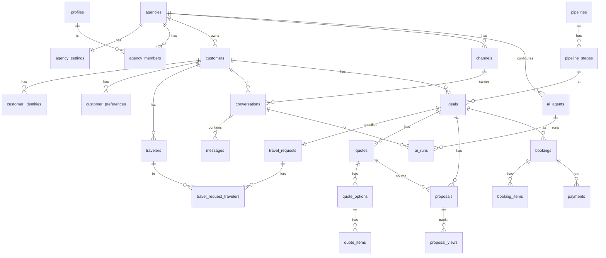

# DATABASE.md — Modelagem (Supabase / PostgreSQL)

> Status: **Fase 0 — proposta**. Esta é a modelagem-alvo; cada fase cria apenas as tabelas de que precisa (ver §10 Migrations).

---

## 1. Convenções

| Tema | Regra |
|---|---|
| Tenant | coluna `agency_id uuid not null` em **toda** tabela de tenant |
| PK | `id uuid default gen_random_uuid()` |
| Integridade cross-tenant | tabelas-pai têm `unique (agency_id, id)`; filhos usam **FK composta** `(agency_id, parent_id) references parent(agency_id, id)` → é impossível, no banco, uma cotação da agência A apontar para um cliente da agência B |
| Timestamps | `created_at timestamptz default now()`, `updated_at` via trigger `set_updated_at()` |
| Autoria | `created_by uuid null references profiles` quando relevante; `source` (`human`/`ai`/`system`/`import`) em dados que a IA pode escrever |
| Dinheiro | `bigint` em centavos (`*_cents`) + `currency char(3)` (default `BRL`). Nunca `float` |
| Datas de viagem | `date` (sem fuso). Instantes: `timestamptz`. Fuso da agência em `agency_settings.timezone` (default `America/Sao_Paulo`) |
| Telefones | E.164 (`+5582999999999`) em `phone_e164` |
| Soft delete | `archived_at` em entidades de negócio; exclusão real só por fluxo LGPD |
| JSONB | apenas para dados semiestruturados validados por Zod (detalhes de item, snapshots, condições de automação). Nunca para dados que precisam de FK ou filtro frequente |
| Nomes | tabelas no plural, snake_case, inglês; enums com valores em inglês; UI em pt-BR |
| Índices | todo `agency_id` indexado (normalmente composto com a coluna de filtro/ordenação) |
| Schemas | `public` (tabelas, com RLS), `private` (funções auxiliares de RLS, não expostas via API) |

---

## 2. Enums

```
agency_role:            owner | manager | consultant | attendant | financial
agency_status:          trial | active | suspended | cancelled
member_status:          invited | active | disabled
plan_code:              trial | starter | pro | premium
subscription_status:    trialing | active | past_due | cancelled
trip_scope:             national | international
trip_type:              honeymoon | family | couple | solo | corporate | cruise | disney |
                        exchange | excursion | package | custom | leisure
                        (specialties da agência reutilizam trip_type + trip_scope)
travel_request_status:  collecting | complete | archived | cancelled
date_flexibility:       exact | flexible_days | month_only | undecided
channel_type:           whatsapp | simulator            (futuro: instagram | messenger | email)
channel_status:         pending | connected | disconnected | error
conversation_mode:      ai | human
conversation_status:    open | pending | closed
message_direction:      inbound | outbound
message_sender:         customer | ai | human | system
message_status:         received | queued | sending | sent | delivered | read | failed
message_kind:           text | image | audio | video | document | location | interactive |
                        template | reaction | unsupported
template_status:        pending | approved | rejected | paused | disabled
quote_status:           draft | ready | archived
quote_item_type:        flight | hotel | transfer | tour | insurance | other
proposal_status:        draft | ready | sent | viewed | negotiating | accepted | rejected | expired
booking_status:         pending | confirmed | traveling | completed | cancelled
booking_payment_status: pending | partial | paid | refunded   (derivado)
payment_kind:           payment | refund
payment_record_status:  pending | confirmed | cancelled
payment_method:         pix | credit_card | debit_card | bank_transfer | boleto | cash | other
task_status:            open | in_progress | done | cancelled
task_priority:          low | normal | high | urgent
followup_status:        scheduled | sent | skipped | cancelled | failed
job_status:             queued | running | succeeded | failed | dead
notification_type:      hot_lead | new_request | quote_needed | proposal_viewed |
                        customer_replied | proposal_accepted | trip_upcoming |
                        followup_overdue | handoff_requested | system
actor_type:             user | ai | system | webhook | platform_admin
```

Perfis (`agency_role`) são enum + matriz de permissões em código (ver SECURITY.md). **Não** criaremos tabela `roles` agora (redundante enquanto não houver papéis customizados).

---

## 3. Tabelas

Legenda: 🔑 PK · 🔗 FK · ⭐ unique · T = tenant (tem `agency_id`)

### 3.1 Plataforma

**plans** — catálogo (não-tenant, leitura pública para autenticados)
`id, code plan_code ⭐, name, limits jsonb` (users, whatsapp_channels, ai_agents, ai_messages_month, contacts, proposals_month, automations, storage_mb), `features jsonb, price_cents null, is_public, created_at`

**subscriptions** (T) — `id, agency_id 🔗 ⭐(ativa), plan_id 🔗, status, trial_ends_at, current_period_start, current_period_end, external_customer_id null, external_subscription_id null` (gateway futuro)

**platform_admins** — `user_id 🔗 profiles 🔑, created_at, created_by`. Super admin **não** é um papel de agência.

**usage_counters** (T) — agregados por período: `agency_id, metric (ai_messages|ai_input_tokens|ai_output_tokens|ai_cost_micros|wa_messages_out|contacts|proposals|storage_bytes), period (date, 1º do mês), value bigint` · ⭐ `(agency_id, metric, period)`

### 3.2 Agência, usuários e onboarding

**profiles** — 1:1 com `auth.users`: `id 🔑🔗 auth.users, full_name, avatar_url, phone_e164 null, created_at, updated_at`

**agencies** — `id, name, slug ⭐, legal_name null, cnpj null, phone_e164, email, website, instagram, logo_path, city, state char(2), country default 'BR', status agency_status, specialties trip_type[], specialty_scopes trip_scope[], onboarding_completed_steps smallint[], onboarding_completed_at, created_at, updated_at`

**agency_settings** (T, 1:1) — `agency_id 🔑🔗, timezone, currency default 'BRL', business_hours jsonb` (por dia da semana, intervalos), `holidays jsonb, temperature_thresholds jsonb default {"warm":31,"hot":61}, consultant_visibility ('all'|'own'), auto_assign ('round_robin'|'manual'), human_reply_takes_over bool default true, ai_outside_hours ('reply'|'reply_and_handoff_next_day'|'silent'), audio_policy ('ask_text'|'handoff'), retention_months_messages int default 24, updated_at`

**agency_members** (T) — `id, agency_id 🔗, user_id 🔗 profiles, role agency_role, status member_status, display_name, is_available bool` (para distribuição), `created_at` · ⭐ `(agency_id, user_id)` · índice `(user_id)`

**agency_invitations** (T) — `id, agency_id, email, role, token_hash ⭐, invited_by, expires_at, accepted_at`

### 3.3 Clientes e viajantes

**customers** (T) — `id, agency_id, full_name, phone_e164, email, city, state, country, birth_date null, source ('whatsapp'|'manual'|'import'|'referral'|...), owner_member_id 🔗 agency_members null` (consultor responsável), `last_contact_at, marketing_opt_in bool default false, marketing_opt_in_at, anonymized_at, archived_at, created_at, updated_at` · ⭐ `(agency_id, phone_e164)` parcial `where anonymized_at is null`
> "Viagens realizadas/futuras, total gasto" são **derivados** (view `customer_stats`), não colunas.

**customer_identities** (T) — identidade por canal: `id, agency_id, customer_id 🔗, channel_type, external_id` (wa_id), `display_name` · ⭐ `(agency_id, channel_type, external_id)`
> Prepara Instagram/Messenger sem retrabalho.

**customer_preferences** (T) — memória estruturada: `id, agency_id, customer_id 🔗, category ('accommodation'|'flight'|'food'|'travel_style'|'destination'|'budget'|'accessibility'|'other'), key, value text, source, evidence_message_id null, confidence ('stated'|'inferred'), locked_by_human bool, created_at, updated_at` · ⭐ `(agency_id, customer_id, category, key)`
> Ex.: `(accommodation, hotel_category, '4 estrelas')`, `(flight, direct_flight, 'prefere voo direto')`.

**travelers** (T) — pessoas que viajam, reutilizáveis entre viagens: `id, agency_id, customer_id 🔗` (titular a quem pertence), `full_name, relationship ('self'|'spouse'|'child'|'parent'|'friend'|'colleague'|'other'), birth_date null, notes, created_at`
> **Não** armazenamos passaporte/CPF por padrão (LGPD, §SECURITY). Se aprovado, campos de documento irão para tabela separada com criptografia e acesso restrito.

**tags** (T) — `id, agency_id, name, color` · ⭐ `(agency_id, lower(name))`
**customer_tags** (T) — `agency_id, customer_id, tag_id` 🔑 composta
**deal_tags** (T) — `agency_id, deal_id, tag_id` 🔑 composta

### 3.4 Pipeline / CRM

**pipelines** (T) — `id, agency_id, name, is_default` (MVP: um pipeline por agência; estrutura permite vários)

**pipeline_stages** (T) — `id, agency_id, pipeline_id 🔗, name, position, color, system_key null, is_won bool, is_lost bool, archived_at` · ⭐ `(pipeline_id, system_key)`
> `system_key` (`new_contact, qualifying, request_complete, quoting, quote_ready, proposal_sent, followup, negotiation, booking, payment, confirmed, post_sale, lost`) permite que a agência **renomeie/reordene** etapas sem quebrar automações, score e relatórios.

**deals** (T) — card do Kanban: `id, agency_id, customer_id 🔗, conversation_id 🔗 null, pipeline_id, stage_id 🔗, stage_entered_at, assigned_member_id 🔗 null, title, expected_value_cents null` (derivado da proposta ativa quando existir), `currency, lead_score smallint default 0, next_followup_at` (denormalizado de followups, mantido por trigger), `lost_reason null, won_at, lost_at, lead_source ('whatsapp'|'instagram'|'referral'|'site'|'manual'|...), is_simulation bool, created_at, updated_at, archived_at`
> Temperatura **não é coluna**: derivada de `lead_score` + `agency_settings.temperature_thresholds` (evita inconsistência quando a agência muda faixas).

**deal_stage_history** (T) — `id, agency_id, deal_id, from_stage_id, to_stage_id, changed_by_actor actor_type, changed_by_user_id null, changed_at` → base do **funil** e do tempo por etapa.

**lead_score_rules** (T) — `id, agency_id, key ('destination_set'|'dates_set'|'party_set'|'budget_set'|'request_complete'|'asked_quote'|'proposal_viewed'|'purchase_intent'|...), points smallint, is_active` (seed com os padrões do briefing)

**lead_score_events** (T) — `id, agency_id, deal_id, rule_key, points, source_event_id, created_at` · ⭐ `(deal_id, rule_key)` (cada regra pontua uma vez)

**notes** (T) — `id, agency_id, customer_id 🔗, deal_id 🔗 null, body text, author_actor actor_type, author_user_id null, created_at`

### 3.5 Solicitações de viagem

**travel_requests** (T) — `id, agency_id, deal_id 🔗 ⭐ (1:1 no MVP), customer_id 🔗, conversation_id 🔗 null, status travel_request_status,`
`origin_city, origin_iata char(3) null, destination text, destination_country char(2) null, destinations_extra jsonb null` (roteiros multi-destino),
`trip_scope null, trip_types trip_type[],`
`departure_date date null, return_date date null, travel_month date null, date_flexibility, nights smallint null` (gerado quando há datas),
`adults smallint null, children_ages smallint[] default '{}', infants smallint default 0,`
`children smallint generated always as (cardinality(children_ages)) stored,`
`budget_cents bigint null, budget_currency, budget_scope ('total'|'per_person') null,`
`needs_flights bool null, needs_hotel bool null, needs_transfer bool null, needs_insurance bool null, needs_tours bool null, needs_car bool null,`
`hotel_category smallint null (1–5), rooms smallint null, meal_plan ('room_only'|'breakfast'|'half_board'|'full_board'|'all_inclusive') null,`
`special_requests text, notes text, field_sources jsonb` (por campo: source, evidence_message_id, locked_by_human), `completed_at, created_at, updated_at`
> Mudanças vs. briefing: `children` vira coluna **gerada** a partir de `children_ages` (sem divergência); `assigned_consultant` e `lead_score` ficam no **deal**; `travel_preferences`/`meal_preferences` genéricas viram `meal_plan` + `customer_preferences`; `trip_type` único vira `trip_scope` + `trip_types[]` (uma lua de mel pode ser internacional). Checks: `return_date >= departure_date`, idades entre 0 e 17, `adults >= 1` quando preenchido.

**travel_request_travelers** (T) — `agency_id, travel_request_id 🔗, traveler_id 🔗, is_holder bool, age_at_departure smallint null` 🔑 `(travel_request_id, traveler_id)`
> Quantidades (`adults`, `children_ages`) são a **composição declarada** (coletada cedo pela IA). Viajantes nominais são preenchidos depois (reserva). A UI alerta divergência.

### 3.6 Canais e conversas

**channels** (T) — `id, agency_id, type channel_type, status channel_status, display_name, phone_e164, wa_phone_number_id ⭐ null, wa_business_account_id null, access_token_encrypted bytea null, token_key_version smallint, ai_agent_id 🔗 null, connected_at, last_error, created_at`

**message_templates** (T) — `id, agency_id, channel_id 🔗, name, language, category ('marketing'|'utility'|'authentication'), status template_status, components jsonb, variables jsonb, purpose ('followup'|'pre_trip'|'post_trip'|'proposal'|'reengage'|'generic'), external_id, synced_at` · ⭐ `(channel_id, name, language)`

**conversations** (T) — `id, agency_id, channel_id 🔗, customer_id 🔗, status conversation_status, mode conversation_mode default 'ai', assigned_member_id null, is_simulation bool, last_message_at, last_inbound_at` (janela 24h), `last_processed_message_id null, unread_count int, summary text, summary_until_message_id null, handoff_reason null, handoff_at, created_at, closed_at`
· índice `(agency_id, status, last_message_at desc)` · ⭐ parcial: uma conversa `open|pending` por `(channel_id, customer_id)`

**messages** (T) — `id, agency_id, conversation_id 🔗, channel_id, direction, sender message_sender, sender_user_id null, kind message_kind, body text, media jsonb null` (storage_path, mime, size — sem URLs públicas), `template_id null, template_vars jsonb null, external_message_id null, status message_status, error_code, error_detail, reply_to_message_id null, ai_run_id null, created_at, sent_at, delivered_at, read_at`
· ⭐ `(channel_id, external_message_id)` → **idempotência do webhook** · índice `(conversation_id, created_at)`

**webhook_events** — plataforma (agency_id preenchido quando resolvido): `id, provider ('meta'), body_hash ⭐, agency_id null, signature_valid bool, payload jsonb, status ('received'|'processed'|'ignored'|'error'), error, received_at, processed_at` · retenção curta (ex.: 30 dias)

### 3.7 Cotações, propostas, reservas, pagamentos

**quotes** (T) — `id, agency_id, deal_id 🔗, customer_id 🔗, travel_request_id 🔗, title, status quote_status, currency, assigned_member_id, internal_notes, ready_at, archived_at, created_by, created_at, updated_at`
> `customer_id` e `travel_request_id` são derivados do deal pelo banco. Opções/itens só mudam com a cotação em `draft` (erro `55000` caso contrário). Criar cotação move o deal para `quoting`; marcar `ready` move para `quote_ready`, conclui a tarefa “Preparar cotação” e emite `quote.ready` (nunca retrocede etapa).

**quote_options** (T) — `id, agency_id, quote_id 🔗, title, position, description, service_fee_cents, discount_cents,`
`subtotal_cents, total_cents, cost_total_cents, margin_cents, commission_total_cents, items_count` (**calculados pelo banco** em trigger a cada escrita de opção/item; valores enviados pelo cliente são sobrescritos; desconto > subtotal + taxa é rejeitado), `created_at, updated_at`

**quote_items** (T) — `id, agency_id, quote_option_id 🔗, item_type quote_item_type, position, title, description, supplier_name, start_date, end_date, quantity smallint default 1,`
`cost_cents, markup_cents, pass_through_fees_cents, commission_cents` (unitários), `price_cents, total_cents` (calculados: preço unitário e × quantidade), `show_price_to_customer bool default true, details jsonb` (união discriminada Zod por tipo), `provider_ref jsonb null` (futuro: id da oferta no provedor), `created_at, updated_at`

**proposals** (T) — `id, agency_id, deal_id 🔗, quote_id 🔗, version smallint, status proposal_status, token_hash bytea ⭐, included_option_ids uuid[], accepted_option_id null, snapshot jsonb` (dados voltados ao cliente, congelados), `payment_terms text, valid_until timestamptz, notes, pdf_path null, sent_at, views_count int default 0, first_viewed_at, last_viewed_at, accepted_at, rejected_at, rejection_reason, created_by, created_at, updated_at`
> `proposal_viewed_at` do briefing = `first_viewed_at`.

**proposal_views** (T) — `id, agency_id, proposal_id 🔗, viewed_at, ip_hash bytea, user_agent_family text`

**bookings** (T) — `id, agency_id, deal_id 🔗, customer_id 🔗, proposal_id 🔗 null, accepted_option_id null, travel_request_id 🔗, assigned_member_id, status booking_status, code` (⭐ por agência, ex. `RES-2026-0042`), `destination, departure_date, return_date, total_cents, currency, cost_total_cents, margin_cents, commission_total_cents, payment_status booking_payment_status` (mantido por trigger a partir de payments), `notes, confirmed_at, cancelled_at, cancel_reason, created_at, updated_at`

**booking_items** (T) — cópia dos itens aceitos + dados operacionais: `id, agency_id, booking_id 🔗, item_type, title, supplier_name, start_date, end_date, price_cents, cost_cents, supplier_locator text null, status ('pending'|'confirmed'|'cancelled'), details jsonb`

**payments** (T) — registros manuais: `id, agency_id, booking_id 🔗, kind payment_kind, status payment_record_status, method payment_method, amount_cents, currency, due_date, paid_at, installments smallint, reference text, notes, recorded_by, gateway ('manual' default), gateway_payment_id null, created_at`
> Status agregado **PENDENTE/PARCIAL/PAGO/REEMBOLSADO** do briefing = `bookings.payment_status` derivado de Σ pagamentos confirmados − reembolsos vs total. Colunas `gateway*` preparam o gateway futuro.

**booking_documents** (T, fase futura) — `id, agency_id, booking_id, doc_type ('ticket'|'voucher'|'reservation'|'insurance'|'receipt'|'other'), storage_path, file_name, mime, size_bytes, visible_to_customer bool, uploaded_by, created_at, expires_at null`

### 3.8 Operação comercial

**tasks** (T) — `id, agency_id, title, description, task_type ('prepare_quote'|'research_hotel'|'send_proposal'|'call_customer'|'confirm_payment'|'send_voucher'|'check_in'|'post_sale'|'other'), status, priority, due_at, assigned_member_id, customer_id null, deal_id null, booking_id null, created_by_actor actor_type, created_by_user_id null, completed_at, created_at`

**followups** (T) — `id, agency_id, deal_id null, customer_id 🔗, conversation_id 🔗, proposal_id null, booking_id null, kind ('proposal'|'reengage'|'pre_trip'|'post_trip'|'custom'), scheduled_at, status followup_status, message_body null, template_id null, template_vars jsonb, cancel_on_reply bool default true, created_by_actor, automation_run_id null, job_id null, sent_message_id null, skip_reason, created_at`

**calendar_events** (T) — somente eventos manuais (ligação, reunião): `id, agency_id, title, starts_at, ends_at, member_id, customer_id null, deal_id null, notes`
> A **Agenda** é a view `agenda_items` = união de `calendar_events`, `tasks.due_at`, `followups.scheduled_at`, `bookings.departure_date/return_date`, `proposals.valid_until`. Sem tabela duplicada.

**notifications** (T) — `id, agency_id, user_id 🔗, type notification_type, title, body, entity_type, entity_id, read_at, created_at` · índice `(user_id, read_at, created_at desc)`

### 3.9 Automações, eventos e jobs

**automations** (T) — `id, agency_id, name, trigger_event text, conditions jsonb, actions jsonb, is_active, is_system bool` (padrões editáveis), `max_runs_per_deal smallint, created_by, created_at, updated_at`

**automation_runs** (T) — `id, agency_id, automation_id 🔗, event_id 🔗, status ('running'|'succeeded'|'partial'|'failed'|'skipped'), results jsonb, started_at, finished_at` · ⭐ `(automation_id, event_id)` (idempotência)

**domain_events** — outbox: `id, agency_id, type, aggregate_type, aggregate_id, payload jsonb, actor_type, actor_id, causation_id null, occurred_at, dispatched_at null` · índice parcial `where dispatched_at is null`

**jobs** — fila: `id, agency_id null, type, payload jsonb, status job_status, priority smallint, run_at, attempts, max_attempts, dedupe_key null, locked_by, locked_at, last_error, created_at, finished_at` · ⭐ parcial `(dedupe_key) where status in ('queued','running')` · índice `(status, run_at, priority)`

### 3.10 IA

**ai_agents** (T) — `id, agency_id, name, persona ('professional'|'friendly'|'travel_consultant'|'premium'|'objective'|'custom'), identity text, tone_instructions text, greeting_message, rules text, extra_business_info text, payment_methods_text, handoff_rules jsonb, enabled_tools text[], is_active bool, version int, published_at, created_at, updated_at`
> Horários, especialidades e dados da agência vêm de `agencies`/`agency_settings` (sem duplicar). `version` incrementa a cada publicação (chave de cache do prompt).

**knowledge_items** (T) — `id, agency_id, category ('faq'|'service'|'destination'|'policy'|'payment'|'institutional'|'differential'|'sales_script'), title, content text, is_published, search_vector tsvector` (gerado, config `portuguese`), `source_file_path null` (upload futuro), `created_at, updated_at` · índice GIN em `search_vector`

**ai_runs** (T) — um turno de orquestração: `id, agency_id, agent_id, conversation_id, trigger_message_id, agent_version, status ('succeeded'|'handoff'|'refused'|'failed'|'skipped'), tool_calls jsonb` (nome, input validado, resultado resumido, erro), `iterations smallint, latency_ms, error, created_at`

**ai_usage** (T) — por chamada à API: `id, agency_id, agent_id null, conversation_id null, ai_run_id null, purpose ('agent'|'summary'|'simulator'|...), model, input_tokens, cache_read_tokens, cache_write_tokens, output_tokens, estimated_cost_micros bigint, latency_ms, request_id, stop_reason, created_at` · índice `(agency_id, created_at)`

### 3.11 Segurança, LGPD e integrações

**audit_logs** (T, agency_id null para ações de plataforma) — `id, agency_id, actor_type, actor_id, action ('member.role_changed'|'conversation.taken_over'|'proposal.sent'|'payment.recorded'|'data.exported'|'customer.anonymized'|'admin.agency_suspended'|'admin.tenant_accessed'|...), entity_type, entity_id, metadata jsonb, ip_hash, created_at` — **append-only** (sem UPDATE/DELETE para ninguém via API)

**consents** (T) — `id, agency_id, customer_id, purpose ('marketing_whatsapp'|'post_sale_contact'|...), granted bool, source, evidence_message_id null, recorded_at`

**data_subject_requests** (T) — `id, agency_id, customer_id, type ('export'|'delete'|'anonymize'|'rectify'), status, requested_by, requested_at, completed_at, result_path null`

**integration_connections** (T) — `id, agency_id, provider ('flight:*'|'hotel:*'|'payment:*'|'calendar:google'|...), status, credentials_encrypted bytea, config jsonb, last_error, created_at` (fase futura)

**rate_limits** — `key text 🔑, window_start timestamptz, count int` (função `private.hit_rate_limit(key, limit, window)`) — usado por webhook, página pública de proposta, login e IA por cliente.

---

## 4. Diagrama de relacionamentos (principal)



---

## 5. Estratégia de RLS

### 5.1 Funções auxiliares (`private`, `security definer`, `stable`, `set search_path = ''`)
```sql
private.is_member(p_agency uuid) returns boolean
  -- exists agency_members where user_id = (select auth.uid()) and agency_id = p_agency and status = 'active'
  --   and agencia não suspensa
private.has_role(p_agency uuid, p_roles agency_role[]) returns boolean
private.member_id(p_agency uuid) returns uuid          -- id do membro do usuário atual
private.can_see_deal(p_agency uuid, p_assigned uuid) returns boolean
  -- owner/manager: sempre; consultant/attendant: se consultant_visibility='all' ou p_assigned = member_id
private.is_platform_admin() returns boolean
```
Usar sempre `(select auth.uid())` e `(select private.fn(...))` nas policies (avaliação única por query — performance).

### 5.2 Padrão por tabela de tenant
```sql
alter table X enable row level security;
alter table X force row level security;

create policy x_select on X for select to authenticated
  using ((select private.is_member(agency_id)));
create policy x_insert on X for insert to authenticated
  with check ((select private.has_role(agency_id, '{owner,manager,consultant}')));
create policy x_update on X for update to authenticated
  using (...) with check (...);           -- with check impede "mover" linha para outra agência
create policy x_delete on X for delete to authenticated
  using ((select private.has_role(agency_id, '{owner,manager}')));
```
Além disso: trigger `prevent_agency_change` impede `UPDATE` de `agency_id` em qualquer tabela.

### 5.3 Matriz resumida (detalhe em SECURITY.md)
| Tabelas | SELECT | INSERT/UPDATE | DELETE |
|---|---|---|---|
| agencies, agency_settings | membros | owner (settings: owner, manager) | ninguém via API |
| agency_members, invitations | membros | owner, manager (manager não cria owner) | owner |
| customers, identities, preferences, travelers, tags, notes | membros exceto financial¹ | owner, manager, consultant, attendant | owner, manager |
| conversations, messages | owner, manager, consultant, attendant | via server actions (envio = linha `queued`) | ninguém |
| deals, travel_requests, stage_history | membros (com `can_see_deal`) | owner, manager, consultant, attendant | owner, manager |
| quotes, options, items | owner, manager, consultant (+ financial leitura) | owner, manager, consultant | owner, manager |
| proposals, proposal_views | owner, manager, consultant, financial | owner, manager, consultant (views: só service role) | ninguém (arquivar) |
| bookings, booking_items | membros | owner, manager, consultant | ninguém (cancelar) |
| payments | owner, manager, financial, consultant (leitura) | owner, manager, financial | ninguém (cancelar registro) |
| tasks, followups, calendar_events | membros | membros ativos (exceto financial p/ followups) | owner, manager, autor |
| automations, ai_agents, knowledge_items, templates, channels | membros (channels sem token²) | owner, manager | owner, manager |
| notifications | somente `user_id = auth.uid()` | service role | próprio usuário |
| ai_runs, ai_usage, usage_counters | owner, manager | service role | — |
| audit_logs | owner, manager | trigger/service role | ninguém |
| jobs, domain_events, webhook_events, rate_limits, platform_admins | **nenhuma policy** (apenas service role) | service role | service role |
| plans | autenticados | — | — |

¹ Perfil financeiro vê dados do cliente necessários à reserva/pagamento (nome, contato) via views específicas; não vê conversas.
² `access_token_encrypted` nunca é selecionável por `authenticated`: coluna revogada (`revoke select (access_token_encrypted) ...`) e leitura apenas no servidor.

Campos de margem/custo: expostos a `authenticated` apenas via view `quote_options_with_margin` restrita por `has_role(..., '{owner,manager}')` ou permissão `quotes.view_margin`; as tabelas base retornam custo apenas para esses papéis (policy por coluna via views `security_invoker`).

### 5.4 Testes de RLS (pgTAP, obrigatórios em toda migration de tabela)
Para cada tabela: usuário da agência A **não** lê/insere/atualiza/deleta dados da agência B; usuário sem vínculo não vê nada; `anon` não vê nada; cada papel só executa o permitido; update não consegue trocar `agency_id`; FK composta impede referência cruzada.

---

## 6. Funções RPC / triggers principais
| Função | Uso |
|---|---|
| `create_agency_with_owner(...)` | signup/onboarding: agência + settings + membro owner + pipeline/etapas padrão + regras de score + automações padrão (transação única) |
| `upsert_inbound_message(...)` | webhook: cliente/identidade/conversa/mensagem atômicos, retorna se inseriu |
| `move_deal_stage(deal, stage)` | valida etapa da mesma agência, grava histórico e evento |
| `transition_proposal(id, to_status)` | máquina de estados + evento |
| `accept_proposal(token_hash, option_id)` | pública (service role): aceita, cria booking draft, evento |
| `record_payment(...)` | grava pagamento e recalcula `bookings.payment_status` |
| `enqueue_job / claim_jobs / complete_job / fail_job` | fila |
| `emit_event(...)` | outbox |
| `apply_lead_score(deal, rule_key, source_event)` | idempotente |
| `anonymize_customer(customer)` | LGPD |
| triggers | `set_updated_at`, `prevent_agency_change`, eventos de status (proposals, bookings, payments), `deals.next_followup_at`, `customers.last_contact_at`, contadores de uso |

---

## 7. Views
`customer_stats` (viagens realizadas/futuras, total gasto, último contato) · `agenda_items` · `upcoming_trips` (bookings confirmados com `departure_date >= today`, dias restantes) · `funnel_by_period` (a partir de `deal_stage_history` + `system_key`) · `dashboard_kpis` (por agência/período) — todas `security_invoker = true` para herdar RLS.

---

## 8. Índices essenciais (além de PK/FK)
`customers (agency_id, phone_e164)`, `customers (agency_id, last_contact_at desc)`, `conversations (agency_id, status, last_message_at desc)`, `messages (conversation_id, created_at)`, `messages (channel_id, external_message_id)`, `deals (agency_id, stage_id, updated_at desc)`, `deals (agency_id, assigned_member_id)`, `travel_requests (agency_id, status)`, `bookings (agency_id, departure_date)`, `followups (status, scheduled_at)`, `tasks (agency_id, assigned_member_id, status, due_at)`, `jobs (status, run_at)`, `domain_events (occurred_at) where dispatched_at is null`, `ai_usage (agency_id, created_at)`, `knowledge_items using gin (search_vector)`, `agency_members (user_id)`.

---

## 9. Entidades do briefing: decisões de normalização
| Sugerida no briefing | Decisão |
|---|---|
| `roles` | substituída por enum `agency_role` + matriz de permissões |
| `customer_preferences` | mantida, estruturada (categoria/chave/valor/fonte) |
| `travelers` | mantida + `travel_request_travelers` (N:N com titular) |
| `deals` | mantida como card do CRM; `travel_requests` 1:1 |
| `quote_items` | mantida com `details jsonb` tipado por tipo de item; + `quote_options` (várias opções por cotação) |
| `proposal_views` | mantida; contadores denormalizados em `proposals` |
| `payments` | registros individuais; status agregado no booking |
| `followups` | mantida (entidade de negócio); execução via `jobs` |
| `ai_usage` | mantida por chamada; + `ai_runs` por turno (necessária ao simulador) |
| `knowledge_documents` | virou `knowledge_items` (upload futuro via `source_file_path`) |
| `usage_records` | virou `usage_counters` (agregado) + `ai_usage` (detalhe) |
| `integration_connections`, `webhook_events`, `audit_logs`, `plans`, `subscriptions`, `notifications` | mantidas |
| novas | `agency_settings`, `agency_invitations`, `customer_identities`, `tags`, `deal_stage_history`, `lead_score_rules/events`, `message_templates`, `booking_items`, `calendar_events`, `domain_events`, `jobs`, `consents`, `data_subject_requests`, `platform_admins`, `rate_limits` |

---

## 10. Migrations planejadas

> Numeração real aplicada: 0001–0006 (fundação), **0007 `pipeline_and_deals`** e **0008 `travel_requests`** (antecipadas das linhas 0012/0013 abaixo). As demais seguem a ordem da tabela a partir de 0009. Aplicadas até agora: 0009 perfil/equipe, 0010 logos, 0011 inbox, 0012 detalhes do cliente e tarefas, 0013 jobs/eventos, **0014 `quotes`** (linha 0025 abaixo).

| # | Migration | Fase |
|---|---|---|
| 0001 | `extensions_and_schemas` — pgcrypto, `private` schema, `set_updated_at()`, `prevent_agency_change()` | 1 |
| 0002 | `enums` — enums base | 1 |
| 0003 | `profiles` — tabela + trigger em `auth.users` para criar perfil | 2 |
| 0004 | `plans_and_platform_admins` — plans (seed trial/starter/pro/premium), platform_admins | 3 |
| 0005 | `agencies_members` — agencies, agency_settings, agency_members, agency_invitations, subscriptions | 3 |
| 0006 | `rls_helpers` — `private.is_member/has_role/member_id/can_see_deal/is_platform_admin` | 3 |
| 0007 | `rls_core_policies` — policies das tabelas 0003–0005 + pgTAP | 3 |
| 0008 | `audit_logs` — tabela append-only + helper `log_audit()` | 3 |
| 0009 | `create_agency_with_owner` — RPC de onboarding | 4 |
| 0010 | `storage_buckets` — `agency-logos` (privado, URL assinada), policies por `agency_id` no path | 4 |
| 0011 | `customers` — customers, customer_identities, customer_preferences, tags, customer_tags, notes, travelers | 6 |
| 0012 | `pipeline_deals` — pipelines, pipeline_stages, deals, deal_tags, deal_stage_history, `move_deal_stage` | 7/8 |
| 0013 | `travel_requests` — travel_requests, travel_request_travelers, checks | 7 |
| 0014 | `lead_scoring` — lead_score_rules (seed), lead_score_events, `apply_lead_score` | 8 |
| 0015 | `tasks` — tasks (base, usada pela IA) | 8 |
| 0016 | `channels_conversations_messages` — channels, conversations, messages, message_templates | 9 |
| 0017 | `notifications` + publicação Realtime (`messages`, `conversations`, `deals`, `notifications`) | 9 |
| 0018 | `jobs_queue` — jobs + `enqueue/claim/complete/fail` | 10 |
| 0019 | `domain_events` — outbox + `emit_event` + triggers iniciais | 10 |
| 0020 | `rate_limits` — tabela + `hit_rate_limit` | 10 |
| 0021 | `ai_usage_runs` — ai_usage, ai_runs, usage_counters | 11 |
| 0022 | `ai_agents_knowledge` — ai_agents, knowledge_items (+ tsvector pt) | 13 |
| 0023 | `simulator_flags` — `is_simulation` em conversations/deals e filtros das views | 14 |
| 0024 | `webhook_events` + `upsert_inbound_message` | 15 |
| 0025 | `quotes` — quotes, quote_options, quote_items, view com margem | 16 |
| 0026 | `proposals` — proposals, proposal_views, `transition_proposal`, `accept_proposal` | 17 |
| 0027 | `storage_proposal_pdfs` — bucket privado | 18 |
| 0028 | `followups` — followups + trigger `deals.next_followup_at` | 19 |
| 0029 | `bookings` — bookings, booking_items | 20 |
| 0030 | `payments` — payments + `record_payment` + trigger de status | 21 |
| 0031 | `calendar` — calendar_events + view `agenda_items` | 22 |
| 0032 | `automations` — automations, automation_runs (+ seeds padrão) | 23 |
| 0033 | `trip_lifecycle` — view `upcoming_trips`, índices de datas | 24/25 |
| 0034 | `analytics_views` — `customer_stats`, `funnel_by_period`, `dashboard_kpis` | 26 |
| 0035 | `admin_views` — agregados de plataforma (sem PII) | 27 |
| 0036 | `usage_limits` — funções de verificação de limite por plano | 28 |
| 0037 | `lgpd` — consents, data_subject_requests, `anonymize_customer`, `retention_sweep` | 29 |
| 0038 | `booking_documents` + bucket (quando aprovado) | futuro |
| 0039 | `integration_connections` | futuro |

Regras: migrations **somente adiante** (nada de editar migration aplicada), cada uma com teste pgTAP correspondente, `supabase db reset` precisa passar do zero, tipos regenerados (`supabase gen types`) após cada migration.
